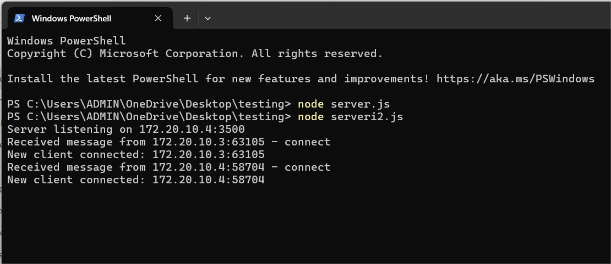
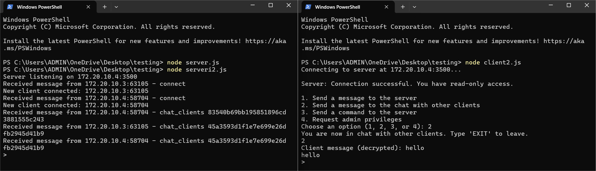
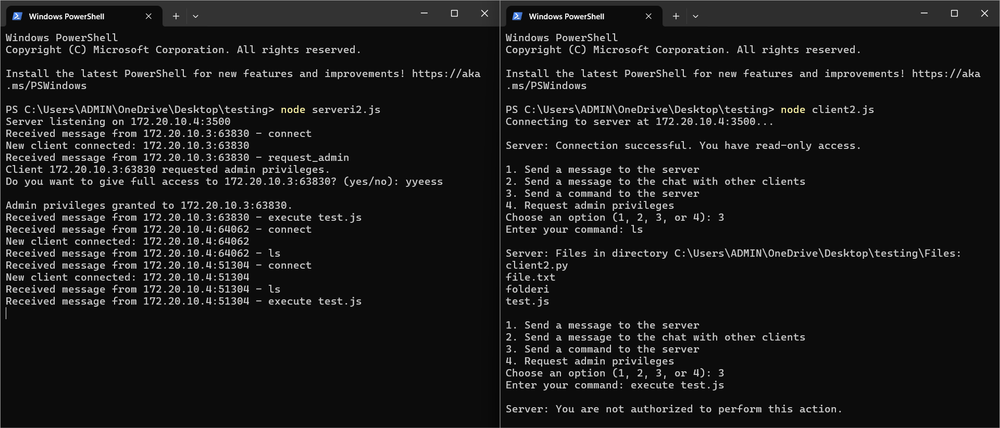

<p align="center">
  
</p>


<h1 align="center">UDP-socket-server-and-client-implementation-in-Node.js</h1>

This is a semester project developed by students at the University "Hasan Prishtina" - Faculty of Electrical and Computer Engineering, in the course "Computer Network" - Prof.Blerim Rexha and PhD.Mergim Hoti.

## Table of Contents
- [Introduction](#introduction)
- [Main Features](#⚙️-main-features)
- [How to Use](#🚀-how-to-use)
- [Setup Instructions](#setup-instructions)
- [Contributors](#contributors)

## Introduction
This project demonstrates a server-client system using UDP sockets. The server listens for client requests, processes incoming messages, and provides either full or restricted access to stored files. 
Additionally, clients can choose to send messages either to the server or directly to other connected clients.

## ⚙️ Main Features

### Server
- **Configuration**: Set the server's IP address and port number.
- **Listening to Clients**: Actively listens for incoming requests from group members.
- **Request Handling**: Accepts and processes client requests.
- **Message Processing**: Reads and processes messages sent by clients.
- **File Access**: Provides full access to one client while restricting access for others.

### Client
- **Socket Creation**: Establishes a UDP socket connection with the server.
- **Client Privileges**: One client has full privileges (read, write, execute), while others have read-only permissions.
- **Server Connection**: Specifies correct port and IP for a successful connection.
- **Message Sending**: Allows clients to send text messages to the server.
- **Command Execution**: Clients can execute different commands such as `ls`, `cd`, `rmdir`, and `mkdir` to interact with the server's file system.
- **File Access**: The client with full privileges can access server file contents.

## 🚀 How to Use
1. **Set Server IP & Port**: Ensure the server's IP address and port number are correctly configured.
2. **Run the Server**: Start the server and wait for client connections.
   ```bash
   node server.js
3. **Start Client(s):** Run the client script to send requests to the server.
   ```bash
   node client.js

## Setup Instructions

1. **Clone the Repository:**
   ```bash
   git clone https://github.com/elonekrasniqi/UDP-socket-server-and-client-implementation-in-Node.js.git

## Contributors:
- [Elma Shabani](https://github.com/ElmaShabani)
- [Elion Mehaj](https://github.com/elionmehaj)
- [Elonë Krasniqi](https://github.com/elonekrasniqi)
- [Elton Pajaziti](https://github.com/EltonPajaziti)


## Code Execution Example
Here is an example of the code running:

  
<strong>Photo 1</strong>: This shows how the server displays the connection status when two clients connect.

<br><br>

  
<strong>Photo 2</strong>: This demonstrates how the clients view each other's messages, while the server sees the messages in an encrypted format.

<br><br>

  
<strong>Photo 3</strong>: This image illustrates the process when a client requests full access and can execute files located in the directory.

<br><br>

  
<strong>Photo 4</strong>: This shows that a client without full access is unable to execute files.
